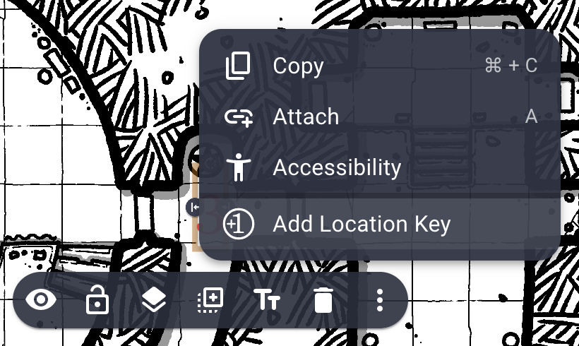
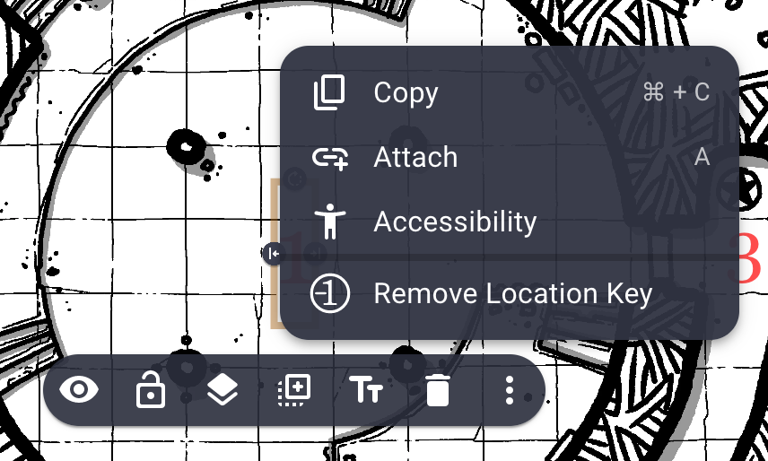
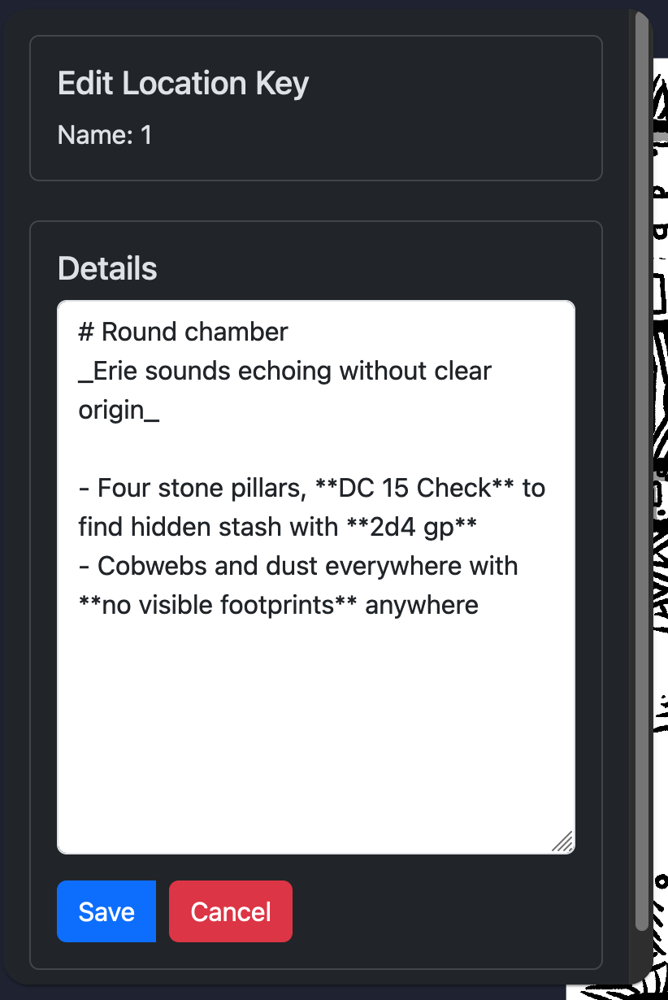

# Map Location Keys


## Description

Map Location Keys is an extension for [Owlbear Rodeo](https://owlbear.rodeo) that allows you to add location keys to a map by using TEXT items.

## Installation

Use the following URL to add this extension to [Owlbear Rodeo](https://owlbear.rodeo):

```text
https://map-location-keys.vercel.app/manifest.json
```

## Features Roadmap

- [x] Add location keys to `TEXT` items
- [x] Markdown support
- [x] Export location keys to a `YAML` file
- [ ] Import location keys from a `YAML` file
- [x] Re-center the scene on an item from its Location Key

## Usage

### Add a Location Key

Select a TEXT item and choose "Add Location Key" from the context menu.



### Remove a Location Key

Select a TEXT item and choose "Remove Location Key" from the context menu.



### Edit a Location Key

You can edit location keys using Markdown.


