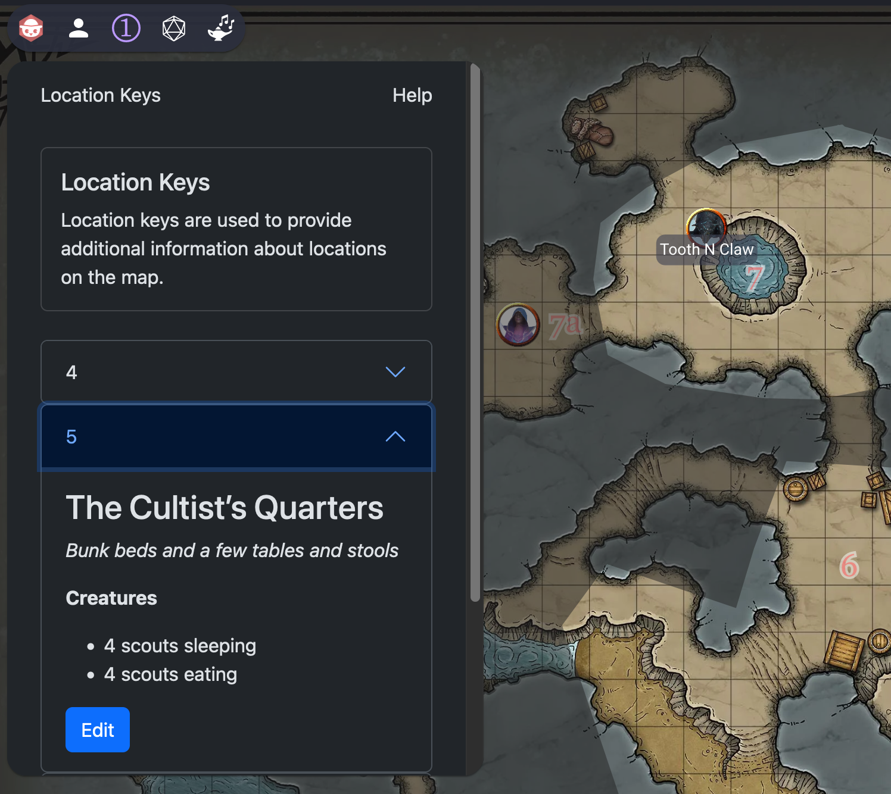

# Map Location Keys

With this extension you can add "location keys" to a map, which usually contain descriptions of a particular room or feature.

It's almost like adding notes/post-its but they are only visible to the GM.

You only need to add a text item to the map, ideally one or two characters long, eg: 1, 5a, B2, etc.

Then using the context menu you can add it to the Location Keys. Now, using the drawer menu you can see a default description has been added for that item, but you can edit it as you like.

The description supports Markdown and there are Import/Export features for handling several locations at a time.

The idea here is to reduce tab switching between OBR and wherever your map descriptions are. With a little prep you can add the descriptions to OBR, ideally in a summarised form, and have a smoother experience.

## Add a Location Key

<!-- markdownlint-disable MD033 -->
<video src="https://github.com/alvarocavalcanti/map-location-keys/raw/main/public/video/01-add-location-key.mp4" width="320" height="240" controls></video>

## Remove a Location Key

<video src="https://github.com/alvarocavalcanti/map-location-keys/raw/main/public/video/02-remove-location-key.mp4" width="320" height="240" controls></video>

## Edit a Location Key

You can edit location keys using Markdown.

<video src="https://github.com/alvarocavalcanti/map-location-keys/raw/main/public/video/03-edit-location-key.mp4" width="320" height="240" controls></video>

## Import Location Keys

<video src="https://github.com/alvarocavalcanti/map-location-keys/raw/main/public/video/04-import-location-keys.mp4" width="320" height="240" controls></video>

## Show Location Key

<video src="https://github.com/alvarocavalcanti/map-location-keys/raw/main/public/video/05-show-location-key.mp4" width="320" height="240" controls></video>

## Export Location Keys

<video src="https://github.com/alvarocavalcanti/map-location-keys/raw/main/public/video/06-export-location-keys.mp4" width="320" height="240" controls></video>
