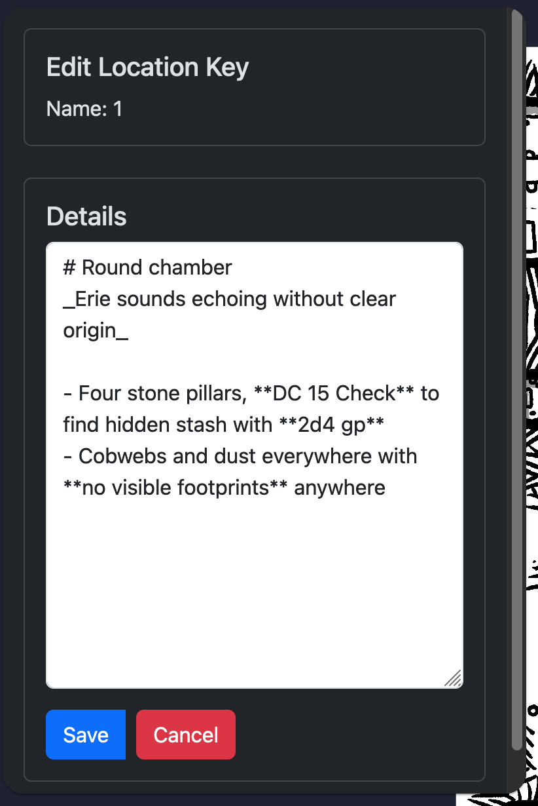

# Map Location Keys

## Add a Location Key

Select a TEXT item and choose "Add Location Key" from the context menu.

## Remove a Location Key

Select a TEXT item and choose "Remove Location Key" from the context menu.

## Edit a Location Key

You can edit location keys using Markdown.

